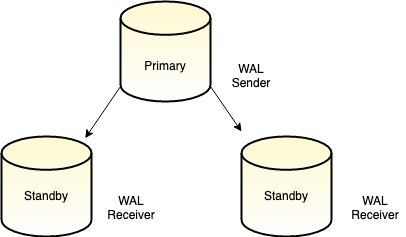
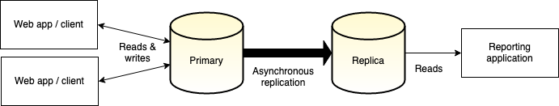
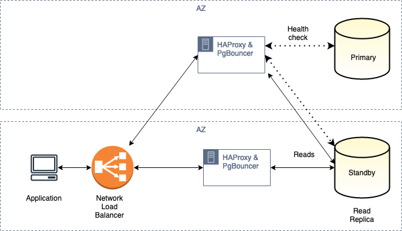

# Database read replicas

This document provides an overview of database read replicas and covers the use
cases where developers may want to use replication for their databases and web
development environments. This document will focus on replication in PostgreSQL
and describes how to benefit from read replicas in a PostgreSQL-based application
architecture.

## What are database read replicas?

A read replica is a copy of a database that contains all of the latest changes
made to a primary database. These two types of databases may be referred to as
"primary/secondary" or "main/replica" in other systems but have the following
terminology in the context of PostgreSQL-based systems:

**Primary:** the database instance which has a leader role assigned. This
instance allows read and write operations on its data.

**Standby:** one or more copies of the primary database which have the latest
changes. These instances are typically read-only.

There are multiple reasons why you might want to employ read replicas in your
architecture. The benefits boil down to two main goals that read replicas can
facilitate:

- **High availability:** multiple copies of the primary are made to avoid data
  loss in cases where the main database is a single point of failure in a
  system. If the primary node is offline for any reason, a failover can be
  performed so that a standby takes the place of a primary.
- **Load balancing:** managing ingress and egress traffic and distributing the
  volume of requests across copies of the same data so that no nodes are
  overloaded. Load balancing is intended to improve performance on both database
  reads and writes.

### How native PostgreSQL replication works

PostgreSQL uses an internal component for data durability called a
write-ahead-log (WAL) that tracks all data changes (`INSERT`, `UPDATE`,
`DELETE`) before they are committed and saved to permanent storage. Each new
data change is assigned a log sequence number (LSN), and the WAL can be used to
recover from crashes by applying changes in the WAL on restart.

The native replication functionality in PostgreSQL relies on the WAL of a
Primary node to establish whether a replica has the most recent information or
not and essentially continuously performs the same operations as an instance
recovering from a crash until it has caught up with a Primary node.



The two modes built into PostgreSQL for replication are **log shipping** and
**streaming replication**. Replicas that only use log shipping are known as warm
standbys and mostly used for a high availability configuration. A warm standby
allows read replicas to take over if a primary server fails. A read replica is
not open for SQL reads in a warm standby configuration.

Log shipping has a low overhead in terms of network and compute resources
because the WAL is sent in batches and is processed in bulk. In contrast,
streaming replication works by continuously sending WAL records over the network
connection from the primary to the standbys. In more recent versions of
PostgreSQL, a combination of log shipping and streaming replication is employed
simultaneously and provides hot standby replicas available for read-only
operations.

The usual process for setting up read replicas in PostgreSQL is to provide a
directory on the primary server where the primary stores archive files. It is
then provided server configuration that enables archiving and replication. This
is done in the `postgresql.conf` file like the following example that turns on
archiving and allows a maximum of three read replicas to connect and replicate
data:

```conf
wal_level = hot_standby
archive_mode = on
max_wal_senders = 3
```

The primary server also needs to allow connections incoming from standby nodes.
This can be configured in the `pg_hba.conf` file like the following example
where `replication_user` is the expected username and `standby_IP` is the public
IP address of the standby instance:

```conf
# Allow replication connections
host     replication     {replication_user}         {standby_IP}/32        md5
```

After the primary instance is restarted, it should expect connections from the
standby nodes to begin replication. To prepare the standby nodes, the files from
the data directory on the primary server should be copied to the same directory
on the standby server. This can be done using the `pg_basebackup` utility **on
the standby server**:

```bash
sudo -u postgres pg_basebackup \
  -h {standby_IP} -ip-addr -p 5432 -U {replication_user} \
  -D /var/lib/postgresql/12/main/ -Fp -Xs -R
```

The flags provided to `pg_basebackup` have common properties such as username
and credentials, but there are some convenient additions at the end of this
command which automate steps that developers might usually have to perform
manually:

- `-Xs` streams the contents of the WAL log as the backup of the primary is
  performed.
- `-R` creates an empty file named `standby.signal` in the replica's data
  directory. This file lets your replica cluster know that it should operate as
  a standby server. The `-R` option also adds the connection information about
  the primary server to the `postgresql.auto.conf` file. This is a special
  configuration file that is read whenever the regular `postgresql.conf` file is
  read, but the values in the `.auto` file override the values in the regular
  configuration file.

After restarting the standby node, replication should be active and the standby
can be used as a replica that allows read-only connections. The example we
described covers one of many possible ways to achieve replication. There is a
considerable amount of configuration for native replication functionality, which
allows for fine-grained control of how data is transferred to replicas and the
architecture required. A full list of native approaches is described in more
detail in the PostgreSQL reference documentation for
[replication solutions](https://www.postgresql.org/docs/current/different-replication-solutions.html).

### Alternatives to built-in functionality

PostgreSQL doesn't provide the functionality to automatically failover when the
primary server fails; this is a manual operation unless you use a third-party
solution. Load balancing is also not automatic with hot standbys. Suppose load
balancing is a requirement for your application. In that case, you must provide
a load-balancing solution that uses the primary server for read-write operations
and the standby server for read-only operations. Due to the popularity of
PostgreSQL, there are many options for handling replication, including
third-party extensions and products which offer PostgreSQL solutions. The
following is a shortlist of standard options that control replication via more
straightforward configuration.

[pgpool-II](https://www.pgpool.net/mediawiki/index.php/Main_Page) is a
middleware that works between PostgreSQL servers and a client. It provides
connection pooling and load balancing by distributing `SELECT` queries among
multiple servers, improving overall throughput. Performance improves
proportionally to the number of PostgreSQL servers. Load balancing works best in
a situation where there are a lot of users executing many queries at the same
time. Parallel queries allow for data to be divided among the multiple servers
to execute a query on all the servers concurrently to reduce the overall
execution time. The parallel query works the best when searching large-scale
data.

A more complicated but well-tested and robust approach is to use a combination
of [PGbouncer](https://www.pgbouncer.org/) and
[HAProxy](http://www.haproxy.org/). PgBouncer is a connection pooler for
optimizing database connections so that applications have improved performance.
PgBouncer can manage database connections well but cannot handle failover
required for deploying high availability. HAProxy's TCP load balancing combined
with PgBouncer is used as an architectural solution to a highly available
deployment.

[Citus](https://www.citusdata.com/product/community) is a popular commercial
solution that easily transforms PostgreSQL into a fully distributed cluster.
Citus is open source, so it can be self-managed on your infrastructure. They
also offer a managed version on Azure where users can set up the entire service
without managing more complex aspects of database configuration.

## Using read replicas

An excellent way to understand when read replicas are beneficial is to consider
some practical examples and use cases. The following section covers two common
use cases that show when to use high availability and load balancing in
PostgreSQL-based web applications and why they suit the needs of each scenario.

### UX insights and data visualization

Take the example of a production PostgreSQL database storing event data from
user sessions on a company's website. We're storing multiple different event
types that record different actions visitors take with a website's UI to drive
more effective design initiatives. The UX team wants to know which parts of the
screen users click on first and the sequences they're using. We're inserting
session views, clicks, and active users into our database and correlating this
information with software releases with different UI components. In terms of the
usage patterns of data access, there's an unpredictable frequency and volume of
write operations happening. One of the requirements is that a UI and UX team
needs to connect multiple data visualization and reporting tools to our database
to find the most commonly used components by users in daily, weekly and monthly
buckets. Having our BI and analytics tools perform regular data-intensive
queries on top of our primary database node would significantly impact read and
write performance.



The asynchronous replication relied upon here will have no guarantee data has
been sent to any replicas. Data is considered written once it has been written
to the primary server's WAL. The WAL sender will stream all WAL data to any
connected replicas, but this will happen asynchronously after the WAL is
written. This replication mode can result in temporary data inconsistency
between the primary and the replicas.

In this case, it's acceptable that there is latency between writes and data
being visible on read replicas because our UX team only need daily reports. We
can ensure that there are read replicas available that do not require data to be
available in real-time but can allow expensive or long-running queries to
without impacting ingestion on our primary node.

### eCommerce application

Consider an eCommerce application that has a PostgreSQL backend for storing
orders and customer transactions. If the primary database crashes or is sent
entirely offline, it would be impossible for the eCommerce store to see a
history of orders, or complete new orders, meaning the entire business function
of the store would be non-operational. Developers should consider a
high-availability setup to prevent data loss for a business-critical deployment
like this.

In this scenario, it would be a good idea to have a single read/write primary
and at least one other warm standby replica, preferable in another region. This
would ensure that disaster recovery mechanisms are in place should an instance
or even a data center go offline. A read replica would be available to view
historical transactions and, depending on the setup, can be elected as a Primary
node role and begin to accept read/write operations.

The diagram below is a simplified version of an architectural solution
[recommended by AWS](https://aws.amazon.com/blogs/database/set-up-highly-available-pgbouncer-and-haproxy-with-amazon-aurora-postgresql-readers/)
for a highly available deployment of their managed PostgreSQL service, Aurora.
The primary and standby nodes are deployed across multiple availability zones
for redundancy. The read replicas serve read-only queries, and the dotted lines
below indicate a custom health check to determine the status of the nodes in the
cluster.


